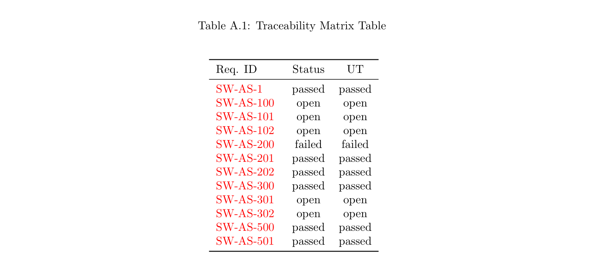

# Motivation

\note{It's an honour to open this topic's session.

When talking about requirements, we should also define the requirements
of the problem we're trying to solve. For all requirements there's a anecdote.}


## Storytime

* Fully automated traceability matrix
* Consistent and up-to-date documents from the source
* Store (requirements') meta-information with code

\note{
\begin{itemize}
\item It's fine manually. Requirements change find minimal delta-test? Change
more than once. Hence we want this fully automated.

\item Review multiple documents for a different
contractor. No consistent set of documents were provided

\item Jon Holt's term in introduction to MBSE: Documents are a live *view* of
the system (not pretty pictures). CI/CD for software, why not for documents?

\item It came with one document that contained all requirements and use-cases. It
appeared to have been exported from some web-based tool. All the information therein
is lost

\item Also: Too technical, interface with management/business side
\item 4'

\end{itemize}
}

# Theory


## Requirements and Traceability

* Requirements across system hierarchies
    * Implies the need for traceability
* *Traceability* from and to specification items
* Directions
    * Forward (*Impact*) from requirements specification to dependant documents
    * Backwards from verification artefacts to specification

\vspace{15px}


\note{Here Traceability only from items/issues}


## Traceability

* *Requirement A*
    * Red button to shut down system
* *Implementation a* says implemented A
	* Traceability can be automated
	* Machine-readable
* What if *A* changes?
	* *A* knows nothing of *a*

\begin{tikzpicture}[remember picture,overlay]
    \filldraw[fill=red!30!white, draw=red,thick] ([xshift=4.2cm,yshift=-2.5cm]current page.center) circle (1.5cm);
    \filldraw[fill=red!80!white, draw=red,thick] ([xshift=4cm,yshift=-2.3cm]current page.center)   circle (1.5cm) node[align=center, text=white] {\textbf{PANIC}} ;
\end{tikzpicture}


## Traceability

* *Requirement A*
    * Green button with large friendly letters: don't panic
* *Implementation a* says implemented `A`
	* Traceability can be automated
	* Machine-readable
* What if *A* changes?
	* *A* knows nothing of *a*
	* Traceability isn't given anymore


\begin{tikzpicture}[remember picture,overlay]
    \filldraw[fill=teal!20!green!30!white, draw=teal!20!green,thick] ([xshift=4.2cm,yshift=-2.5cm]current page.center) circle (1.5cm);
    \filldraw[fill=teal!20!green!80!white, draw=teal!20!green,thick] ([xshift=4cm,yshift=-2.3cm]current page.center)   circle (1.5cm) node[align=center, text=white, text width=2.5cm] {\textbf{DON'T PANIC}};
\end{tikzpicture}


## Proposed Solution

* *Requirement A-1.0*
    * Red button to shut down system
* *Implementation a* says implemented *A-1.0*
    * *A-1.0* (red button) changes to *A-2.0* (green button)
	* Use hashes instead of semantic versioning
	* Calculated automatically


\begin{tikzpicture}[remember picture,overlay]
    \filldraw[fill=teal!20!green!30!white, draw=teal!20!green,thick] ([xshift=4.2cm,yshift=-2.5cm]current page.center) circle (1.5cm);
    \filldraw[fill=teal!20!green!80!white, draw=teal!20!green,thick] ([xshift=4cm,yshift=-2.3cm]current page.center) circle (1.5cm) node[align=center, text=white, text width=2.5cm] {\textbf{DON'T PANIC}};
\end{tikzpicture}


\note{Why hashes: no tool or manual changes required, it's all derived

Let's see how it looks on an example}


## Example Requirement

\vfill


\vspace{1em}

*Hash* is calculated over *Name*, *Description* and *Verification Method*.
Rationale is only informative


```bash
$ sha256sum "${Name}${Description}${VerifMethod}"
```

\vfill\tiny
Example from [pymergevcd's architecture specification](https://kown7.github.io/pymergevcd/#architecture)

\note{A from previous slides is now SW-AS-501

Version n.0 is now \texttt{F8D68D11}}

## Testing the Example Requirement

* Requirement ID: `SW-AS-501`
* Hash: `F8D68D11`
* Status: *external*

::: {.block}
### Test Code
\tiny
```python
def test_read_write_engines(record_property, dummy_vcd_file):
    """Write-back from read file, equal output"""
    record_property('req', 'SW-AS-501-f8d68d11')
    record_property('req', 'SW-AS-500-4c1a395a')
    ...
    assert filecmp.cmp(dummy_vcd_file, ofile)
```
:::


::: {.block}
### xUnit Output
\tiny
```xml
<testcase   line="20" name="test_read_write_engines" time="2.830">
  <properties>
    <property name="req" value="SW-AS-501-f8d68d11"/>
    <property name="req" value="SW-AS-500-4c1a395a"/>
  </properties>
</testcase>
```
:::


## Traceability Matrix



\note{Now it should be straightforward to integrate it into any CI pipeline}

## Integrating Requirements into CI/CD

* Integration for every output document
* Match *open* and/or *failed* issues
* Example for *failed* issues

```bash
$ bash -ec 'test "$(grep -c failed \
    arch/artifacts/tracematrix.tex)" -eq "0"'
```


\note{This is all nice and dandy; but how do we communicate with people for whom git clone is too much to ask?

HERE:
* Contribution of mine hervorstreichen
}


# sltoo in Practice


## Document Baseline

Every document has a its own version tag

```bash
$ git tag -a RS/1A
$ git describe $(git log -n 1 --format=%H -- docs/reqs)
```

The output from `git describe` will be used as document baseline

```bash
  RS/1A — 0aec3ad0              # good
  RS/1A-8-g76b3ffe — 76b3ffe4   # tainted
```

Example excerpt from page 7


# Business Interface


## Excel Workflow

* Non-tech people define the requirements
* Familiarity / Ease-of-use
* Consistency of Documents
    * Works if all you've got is Office and E-Mail

* INSERT IMAGE HERE


# Conclusion

## Storytime Revisited

* Requirements shipped with code \checkmark
    * Including relational meta-information
* Traceability matrix automated \checkmark
* Continuously updated documentation \checkmark
    * Document Versioning (baselining) \checkmark

\note{Your Jira workspace will be gone}


# Questions


\appendix


## Excel Support Rationale


::: columns

:::: column
* Good-enough GUI
* Understood by everyone
* The *Truth* is still in your repository
  * Import from Excel to repository
  * Export every build to a new Excel file
  * Templating for branding
::::

:::: column
{ height=75% }
::::

:::


## *rmtoo* -- Introductions

An
\href{https://github.com/florath/rmtoo/releases/download/v23/rmtooIntroductionV9.pdf}{introduction
presentation} into *rmtoo*  and with more
\href{https://github.com/florath/rmtoo/releases/download/v23/rmtooDetailsV5.pdf}{details}.


## Traceability Rationale

* Traceability for the given requirements
* Bring code and documentation into same repository
* Integrate into build-system
  * Detect upstream changes to requirements
  * Quickly identify affected code-regions
* No silver bullet for verification


## Results

The status *external* will yield the following results:

* *open*
    * No matching requirement ID
* *passed*
    * Matching requirement ID
	* All hashes match
	* Unit-tests passed
* *failed*
    * Matching requirement ID
	* Some/all hashes didn't match, or
	* Unit-tests haven't passed


## Installation

Traceability features are in the beta releases.

```bash
$ pip3 install sltoo>=25.1.0b3
$ wget https://kown7.github.io/pymergevcd/assets/template_project.zip
```

## Future Developements

* Write Parser for *Test Reports* \checkmark
* Documents with the correct identifier automatically solve the specification
	* Document Formats:
	    * docx (maybe with pandoc)
		* \LaTeX \checkmark
		* Text


## Final Thoughts

* Never test against your requirements
* Always write some form of test specification

## Licensing

\doclicenseThis


## Baseline

* Based on [rmtoo](https://github.com/florath/rmtoo)
    * File-based requirements tracking tool
    * Requirements stored in text-files
    * group requirements by topics
    * document and requirements \LaTeX based
	   * Customizable with templates
* Manage with your favourite VCS
	* Merge changes from various sources
* Excel import/export
* Traceability


## Example Requirement


::: columns

:::: column
\tiny
```
Name: VCD Writer Inputs
Topic: ReqsDocument
Description: The output from ...
Rationale: Make the process as ...
Status: external
Owner: development
Effort estimation: 1
Invented on: 2020-05-30
Invented by: default
Type: requirement
```
::::

:::: column

::::

:::

\vspace{1em}
*Hash* is calculated over *Name*, *Description* and *Verification Method*


