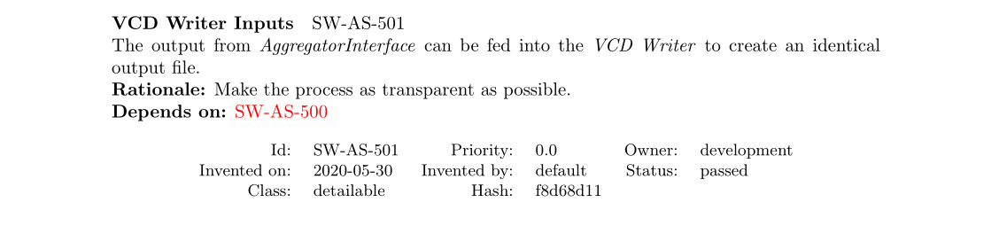

## Welcome

* Motivation
* Theory
* Practical Aspects
* Demonstration
* Conclusion

\note{

\begin{itemize}

\item Welcome everyone to FOSDEM22 from my side. Welcome to my talk about req. 
specification documents and how to test them. It's an honour to be closing this
stream.

\item Given the topic is requirements specifications, maybe we should specify the problems we're trying to solve.

\item So, imagine \ldots

\end{itemize}
}


## Motivation

* Automated traceability \textcolor{Mycolor1}{matrix}
* *Consistent* and *up-to-date* documents
* Store *meta-information* with code

\note{ \tiny
\begin{itemize}
\item being a reasonably junior developer and you're tasked with creating a
traceability matrix in Word for given artefacts in a space application. The 
first time round you're doing work that needs to be done either way --- fair 
game. By the time the fifth CR comes along, it gets tiresome.

\item Alright, consultant live: new project, new customer, new set of 
documents to review. I can't recall any details but the fact that links and 
references didn't add up.

\item To use Jon Holt's term in introduction to MBSE: Documents are a live *view* of
the system (not pretty pictures). We have CI/CD for software, why not for documents?

\item So far, challenges could be handled with any ALM tool on the market. 

\item But then, the project from the musty crypt, language features from an 
OS specific compiler. The OS itself isn't available for the target platform. 
At least there's a specification. Looking like it's been exported from some web
based ALM tool that's long gone too.

\item It came with one document that contained all requirements and use-cases. It
appeared to have been exported from some web-based tool. All the information therein
is lost time.

\item myself: As you can guess, (FPGA) test-engineer for various space/railway applications 8 yrs

\item 4'

\end{itemize}
}


# Theory


## Requirements and Traceability

* Requirements across system hierarchies
    * Implies the need for traceability
* *Traceability* from and to specification items
* Directions
    * Forward (*Impact*)
    * Backwards

\vspace{15px}


\note{
Let's start with a simple and theoretical example

Here Traceability only from items/issues}


## Traceability

* *Requirement A*
    * Red button to shut down system
* *Implementation a* says implemented A
	* Traceability can be automated
	* Machine-readable
* What if *A* changes?
	* *A* knows nothing of *a*

\begin{tikzpicture}[remember picture,overlay]
    \filldraw[fill=red!30!white, draw=red,thick] ([xshift=4.2cm,yshift=-2.5cm]current page.center) circle (1.5cm);
    \filldraw[fill=red!80!white, draw=red,thick] ([xshift=4cm,yshift=-2.3cm]current page.center)   circle (1.5cm) node[align=center, text=white] {\textbf{PANIC}} ;
\end{tikzpicture}


## Traceability

* *Requirement A*
    * Green button with large friendly letters: don't panic
* *Implementation a* says implemented `A`
	* Traceability can be automated
	* Machine-readable
* What if *A* changes?
	* *A* knows nothing of *a*
	* Traceability isn't given anymore


\begin{tikzpicture}[remember picture,overlay]
    \filldraw[fill=teal!20!green!30!white, draw=teal!20!green,thick] ([xshift=4.2cm,yshift=-2.5cm]current page.center) circle (1.5cm);
    \filldraw[fill=teal!20!green!80!white, draw=teal!20!green,thick] ([xshift=4cm,yshift=-2.3cm]current page.center)   circle (1.5cm) node[align=center, text=white, text width=2.5cm] {\textbf{DON'T PANIC}};
\end{tikzpicture}


## Proposed Solution

* *Requirement A-1.0*
    * Red button to shut down system
* *Implementation a* says implemented *A-1.0*
    * *A-1.0* (red button) changes to *A-2.0* (green button)
	* Use hashes instead of semantic versioning
	* Calculated automatically


\begin{tikzpicture}[remember picture,overlay]
    \filldraw[fill=teal!20!green!30!white, draw=teal!20!green,thick] ([xshift=4.2cm,yshift=-2.5cm]current page.center) circle (1.5cm);
    \filldraw[fill=teal!20!green!80!white, draw=teal!20!green,thick] ([xshift=4cm,yshift=-2.3cm]current page.center) circle (1.5cm) node[align=center, text=white, text width=2.5cm] {\textbf{DON'T PANIC}};
\end{tikzpicture}


\note{Why hashes: no tool or manual changes required, it's all derived

Let's see how it looks on an example}


## Example Requirement


\vfill

::: columns

:::: column
\tiny
```
Name: VCD Writer Inputs
Topic: ReqsDocument
Description: The output from ...
Rationale: Make the process as ...
Status: external
Owner: development
Effort estimation: 1
Invented on: 2020-05-30
Invented by: default
Type: requirement
```
::::

:::: column
*Hash* is calculated over *Name*, *Description* and *Verification Method*


```bash
$ sha256sum ${Name} \
    ${Description} \
	${VerifMethod}
```

::::

:::

\vspace{1em}




\vfill\tiny
Example from [pymergevcd's architecture specification](https://kown7.github.io/pymergevcd/#architecture)

\note{

\begin{itemize}

\item Every requirement is in its own file

\item A from previous slides is now SW-AS-501

\item Version n.0 is now \texttt{F8D68D11}

\end{itemize}

}


## Testing the Example Requirement

* Requirement ID: `SW-AS-501`
* Hash: `F8D68D11`

::: {.block}
### Test Code
\tiny
```python
def test_read_write_engines(record_property, dummy_vcd_file):
    """Write-back from read file, equal output"""
    record_property('req', 'SW-AS-501-f8d68d11')
    record_property('req', 'SW-AS-500-4c1a395a')
    ...
    assert filecmp.cmp(dummy_vcd_file, ofile)
```
:::


::: {.block}
### xUnit Output
\tiny
```xml
<testcase   line="20" name="test_read_write_engines" time="2.830">
  <properties>
    <property name="req" value="SW-AS-501-f8d68d11"/>
    <property name="req" value="SW-AS-500-4c1a395a"/>
  </properties>
</testcase>
```
:::


## Traceability Matrix


\note{Now it should be straightforward to integrate it into any CI pipeline}

## Integrating Requirements into CI/CD

* Integration for every output document
* Match *open* and/or *failed* issues
    * Left as an excercise for the reader
* Example for *failed* issues

```bash
$ bash -ec 'test "$(grep -c failed \
    arch/artifacts/tracematrix.tex)" -eq "0"'
```


\note{
9'
}


# sltoo in Practice

## sl... what?


* *sltoo* (currently) a fork of rmtoo
    * text-file based req. tracking tool
* Tracking requirements in text files with git 
    * might be ideal for engineering department
* Defining system behaviour is a team effort
* Solution not for everyone / command-line unfamiliar UI


\note{

\begin{itemize}

\item Fork of the venerable rmtoo (requirements management tool)
\item Guess: most people aren't familiar with the tooling/console --> Which tool is "everyone" familiar with?

\end{itemize}
}


## Excel Workflow (I)

* Defining system collaborative effort
* Familiarity / Ease-of-use
* Consistency of Documents
    * The *Truth* is always in your repository
    * Templating for branding
* Works if all you've got is Office and E-Mail
* Getting Started: Edit [example Excel-Sheet](https://kown7.github.io/pymergevcd/assets/requirements/artifacts/specification.xlsx)

\centering
{ width=75% }

\note{Simply use the excel sheet as long as no documents or verification tasks are necessary

Stepping stone for requirements tracking
}

## Excel Workflow (II) – Distribution


\centering
{ height=75% }


## Excel Workflow (III) – Merging

\centering
{ height=75% }

\note{
\begin{itemize}

\item Commit for every author individually -> also put name in commit for easier lookup
\item Truth stays in repository
\item \texttt{git tag} makes new document releases as easy as possible

\end{itemize}
}


## Document Baseline

Every document has a its own version tag

```bash
$ git tag -a RS/1A
$ git describe $(git log -n 1 --format=%H -- docs/reqs)
```

The output from `git describe` will be used as document baseline

```bash
  RS/1A — 0aec3ad0              # good
  RS/1A-8-g76b3ffe — 76b3ffe4   # tainted
```

Example excerpt from page 7:


\note{Exercise to reject tainted documents in referenced documents}


## Outlook

* Merge changes with *rmtoo*
* Transform *sltoo* into a GUI
    * Provide a GUI to show relations between items
	* Provide cross-documents editing capabilities
    * Update hashes in sources
* How much can AI help?

\note{
\begin{itemize}

\item Replace your current ALM tool with a diverse set of existing/open tools

\end{itemize}
}


# Demonstration

## Demonstration Notes

* Traceability still in beta
    * [Template Project](https://sltoo.dev/#getting-started)
    * hopefully released by 5th of February
* Demo is in `FOSDEM22` [branch](https://github.com/kown7/rmtoo/tree/FOSDEM22)
    * [ESA DOORS dump](https://ecss.nl/standards/downloads/earm/)
	* use your search engine of choice
* Set *Status* from *not done* to *external*
* Configure lengths not to be affected by large ESA requirements
    * see `Config.json` 
* Images, tables and graphs are to be demonstrated, see the [homepage](https://sltoo.dev) for updates


\note{
\begin{itemize}

\item Note to  self: write a better script

\end{itemize}
}

# Conclusion

## Storytime Revisited

* Requirements shipped with code \checkmark
    * Including relational meta-information
	* Use commit message to document the *why* 
* Traceability matrix automated \checkmark
* Continuously updated documentation \checkmark
    * Document Versioning (baselining) \checkmark

A familiar UI for all stakeholders included

\note{
\begin{itemize}

\item Where did we leave off? Have we solved all the problems we set out in the beginning 
\item Your Jira workspace will be gone

\item This concludes this talk and this stream. If everything went according to schedule I'm around for questions

\end{itemize}
}


# Questions


\appendix


## *rmtoo* -- Introductions

An
\href{https://github.com/florath/rmtoo/releases/download/v23/rmtooIntroductionV9.pdf}{introduction
presentation} into *rmtoo*  and with more
\href{https://github.com/florath/rmtoo/releases/download/v23/rmtooDetailsV5.pdf}{details}.


## Traceability Rationale

* Traceability for the given requirements
* Bring code and documentation into same repository
* Integrate into build-system
  * Detect upstream changes to requirements
  * Quickly identify affected code-regions
* No silver bullet for verification


## Results

The status *external* will yield the following results:

* *open*
    * No matching requirement ID
* *passed*
    * Matching requirement ID
	* All hashes match
	* Unit-tests passed
* *failed*
    * Matching requirement ID
	* Some/all hashes didn't match, or
	* Unit-tests haven't passed


## Installation

* Traceability features are in the beta releases. 
* Document to document traceability requires beta-4 at least

```bash
$ pip3 install sltoo>=25.1.0b4
$ wget https://kown7.github.io/pymergevcd/assets/template_project.zip
```


## Alternatives

* [Sphinx-Needs](https://sphinxcontrib-needs.readthedocs.io/en/latest/)
* [Octane ALM](https://www.microfocus.com/en-us/products/alm-octane/overview)
* [Codebeamer](https://codebeamer.com)
* [Aligned elements](https://www.aligned.ch/)
* See [Wikipedia](https://de.wikipedia.org/wiki/Software-Configuration-Management#Diverse_Softwareentwicklungsprodukte)
* ...

## Future Developements

* Write Parser for *Test Reports* \checkmark
* Documents with the correct identifier automatically solve the specification
	* Document Formats:
        * docx (maybe with pandoc)
        * \LaTeX \checkmark
        * Text
        * CAD Files from HW/Mechanical
* GUI with multi-documents support (RS/TS/..)
    * Simplify design process

## Final Thoughts

* Never test against your requirements
* Always write some form of test specification

## Licensing

\doclicenseThis


